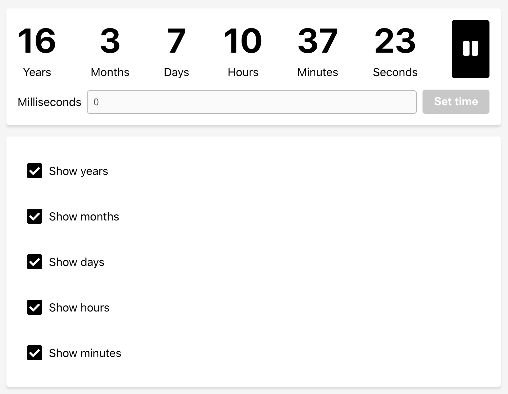

## Countdown using React

## Features

- Navigation and usage with keyboard only
- Set countdown as milliseconds
- Configurable output (Years, Months, Days, Hours, Minutes)
- Saving countdown in browser storage (you can close browser without losing countdown)
- Countdown continue during closed browser (wow, can you imagine about this feature?)
